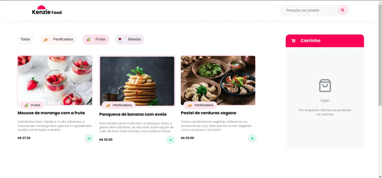

<div align="center" id="top"> 
  

  &#xa0;

  <a href="https://kenzie-academy-brasil-developers.github.io/api-kenziefood-m2-felipesindeaux/">Site</a>
</div>

<h1 align="center">Api Kenziefood M2</h1>

<p align="center">
  

  

  

  

</p>


<p align="center">
  <a href="#dart-about">About</a> &#xa0; | &#xa0; 
  <a href="#rocket-language">Language</a> &#xa0; | &#xa0;
  <a href="#white_check_mark-requirements">Requirements</a> &#xa0; | &#xa0;
  <a href="#checkered_flag-starting">Starting</a> &#xa0; | &#xa0;
  <a href="#memo-license">License</a> &#xa0; | &#xa0;
  <a href="https://github.com/Kenzie-Academy-Brasil-Developers/api-kenziefood-m2-felipesindeaux/graphs/contributors" target="_blank">Author</a>
</p>

<br>

## :dart: About ##

Projeto feito pela <a href="https://kenzie.com.br/" target="_blank">Kenzie Academy Brasil </a>que desenvolvemos um projeto de um ecomerce utilizando Html, Css, Javascript (POO e API). Agradecer ao nosso facilitador <a href="https://www.linkedin.com/in/jardel-lacerda/" target="_blank">Jardel</a> que ajudou a gente nessa etapa de nossas vidas.

## :rocket: Language ##

The following tools were used in this project:

- [Html](https://github.com/Kenzie-Academy-Brasil-Developers/api-kenziefood-m2-felipesindeaux)
- [Css](https://github.com/Kenzie-Academy-Brasil-Developers/api-kenziefood-m2-felipesindeaux)
- [Javascript](https://github.com/Kenzie-Academy-Brasil-Developers/api-kenziefood-m2-felipesindeaux)

## :white_check_mark: Requirements ##

Before starting :checkered_flag:, you need to have [Git](https://git-scm.com) and [Node](https://nodejs.org/en/) installed.

## :checkered_flag: Starting ##

```bash
# Clone this project
$ git clone https://github.com/Kenzie-Academy-Brasil-Developers/api-kenziefood-m2-felipesindeaux

# Access
$ cd api-kenziefood-m2-felipesindeaux

# Install dependencies
$ npm

# Run the project
$ npm start

# The server will initialize in the <http://localhost:3000>
```

## :memo: License ##

This project is under license from MIT. For more details, see the [LICENSE](LICENSE.md) file.


Made with :heart: by 
<a href="https://www.linkedin.com/in/carlos-vitor-ribeiro-cerqueira-lima-08aa78212/" target="_blank">Carlos Vitor, </a>
<a href="https://www.linkedin.com/in/rodrigo-firmo/" target="_blank">Rodrigo Firmo, </a>
<a href="https://www.linkedin.com/in/felipesindeaux/" target="_blank">Felipe Sindeaux.</a>

&#xa0;

<a href="#top">Back to top</a>
